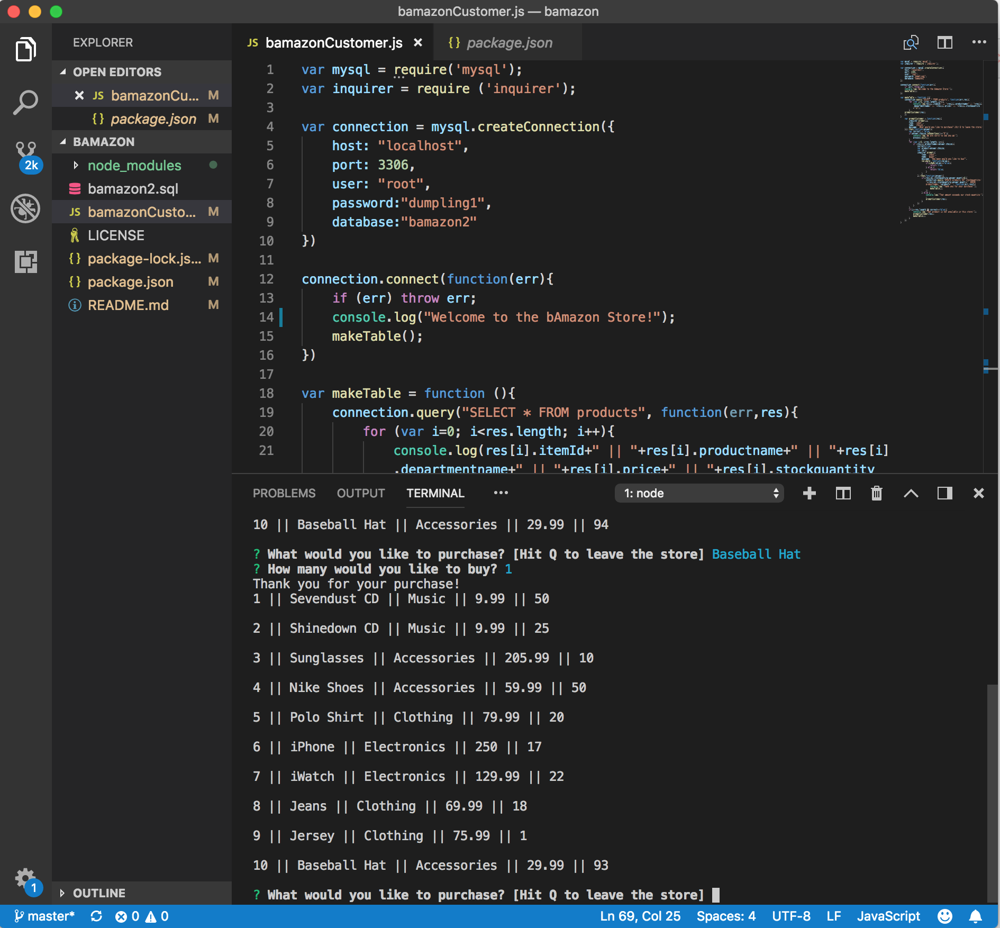
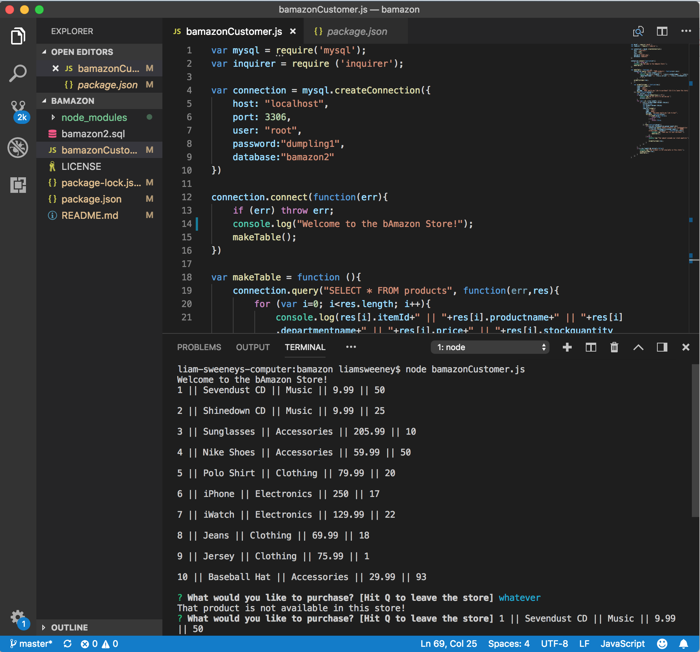
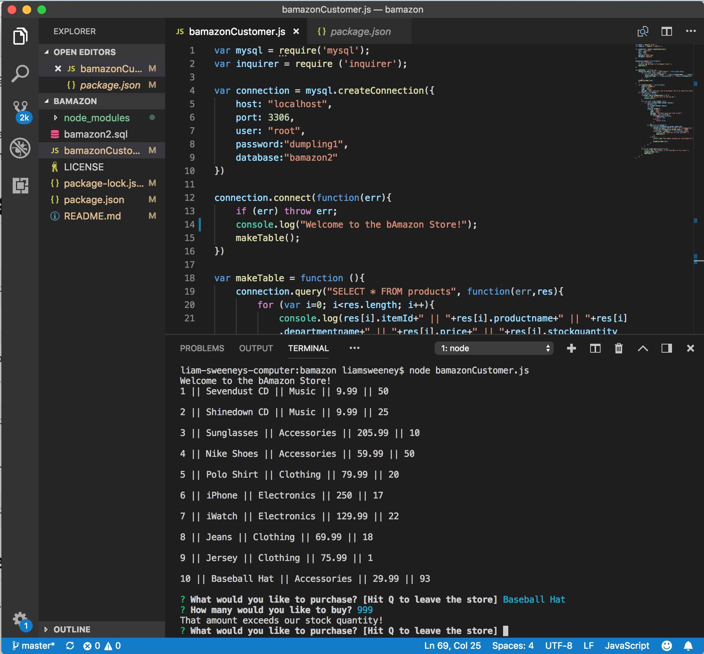

# Homework Assignment Week 12:
### bamazon

This repository is for the week 12 homework assignment for University of Miami Coding Bootcamp. 

This Amazon-like storefront uses Node.js to manipulate an inventory of products populated in MySQL. The assignment is to create interfaces from the point-of-view of the Customer, the Manager, and the Executive.

## Customer Interface:
1. The user ("customer") is welcomed to the bAmazon Store and able to view the current inventory of store items: item IDs, descriptions, departments in which the items are located and their prices. 

3. Following this prompt, the user is able to purchase one of the in-stock items by entering the product name. Should their input not match an available product, they will receive the following message: "That product is not available in this store!"

4. If the product name matches an inventory item, the user will be prompted to select the quantity in which they'd like to purchase. If the requested quantity does not exceed the existing stock quantity, the user's order is fulfilled, and the store database is updated to accurately reflect the new stock quantity. The user is thanked for their purchase. 

5. If the order exceeds the stock quantity, the user will receive the following message: "That amount exceeds our stock quantity!" and they are presented with the original store view from which to choose.

5. The user can exit the store at any time by hitting "Q". 

Leaving the Store:

Making a Successful Purchase:

Asking for a Non-existant Item:

Exceeding the Stock Quantity:

## Manager Interface:
(Work In Progress)

## Executive Interface:
(Work In Progress)

Liam Sweeney 2018
